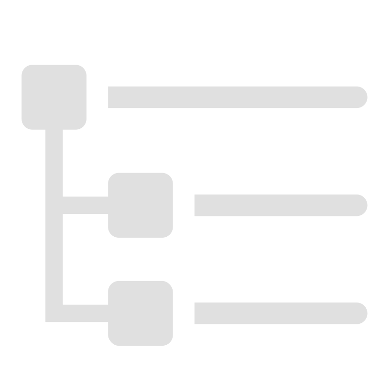
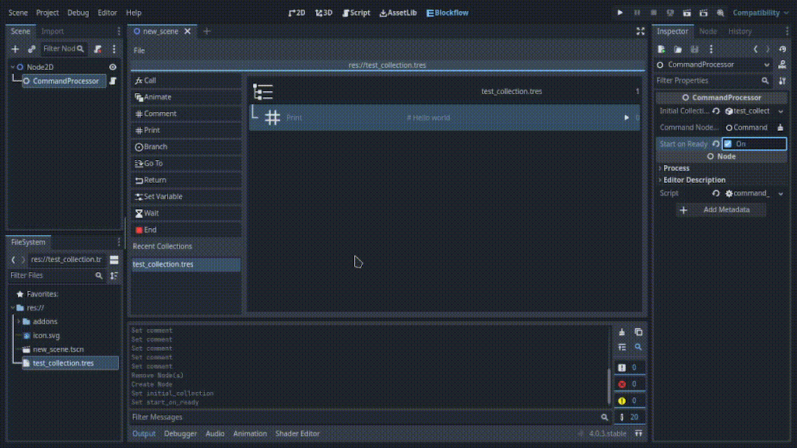
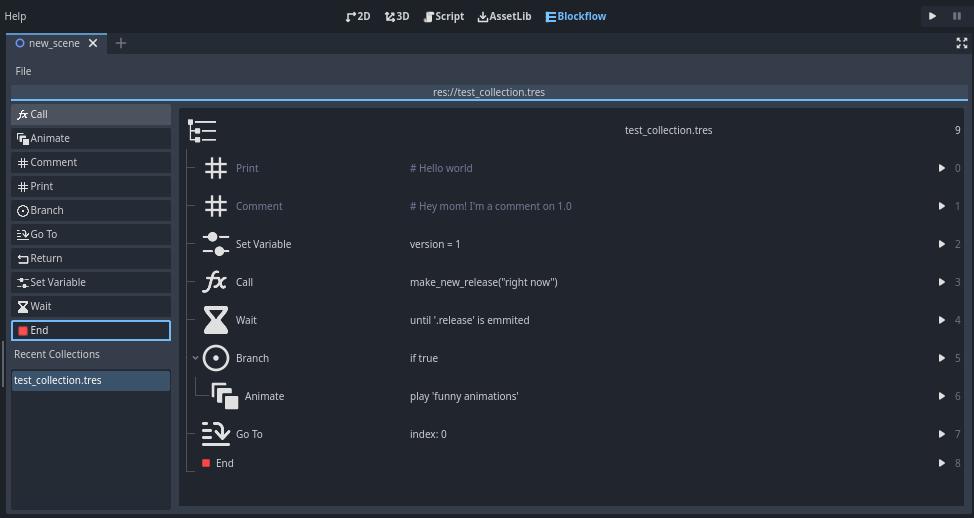
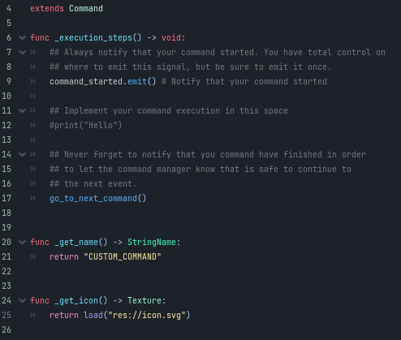

<!-- Gosh, somebody help me here, I have no words for now -->
<!-- Update: Still have no words -->

<!-- Hi future devs!

While testing stuff in this very early stage, make sure to use `playground` scene.

That scene will be moved eventually (like any other file in this repository)
so make sure to know always where `playground` is to test stuff.

I'll make sure to point where it'll be in future release, after defining the
plugin structure. -->

#  Godot Blockflow

A visual block style scripting for Godot 4.

---

Blockflow is a visual scripting plugin for Godot, made to create sequential instructions
that are executed one by one, easy to implement and highly customizable, allowing you to execute
code fragments in order according to the conditions you give it.

It helps in scenarios where you require a controlled execution of steps in
your games, such as a dialog system or the creation of cutscenes, without the need to recreate
an entire sequence by code.

Supports **any Godot 4** version.

## Getting started
### Installation
Blockflow is a Godot plugin, it can be installed normally as [official Godot documentation](https://docs.godotengine.org/en/stable/tutorials/plugins/editor/installing_plugins.html) guides:

- Download the plugin from the latest release.
- Extract the folder under your project `addons` folder (if the folder doesn't exist, create one).
- Go to Project -> Project Settings -> Plugins and mark `Blockflow` checkbox.

If everything works, you'll see `Blockflow` button at the top of Godot editor, next to 2D/3D/AssetLib buttons.


#### Using git
You can install this repository as a submodule from your project root folder:
```shell
git submodule add https://github.com/AnidemDex/Blockflow  addons/blockflow
```

#### From Godot's AssetLib
> AssetLib submission is still pending, so it'll not appear for the moment.

- Search for `Blockflow` on `AseetLib` screen in Godot editor.
- Select the plugin.
- Click on install.

#### Updating

To update the plugin manually:

- Close Godot editor.
- Remove `blockflow` folder.
- Add the new `blockflow` folder.
- Open Godot editor.

> If you present any error when updating, [open a new issue](https://github.com/AnidemDex/Blockflow/issues/new).

### First steps

Blockflow consists on two main objects: `Collection` and Processor. Collections (specifically `CommandCollection`) contains data about the steps that it will take, and Processor execute those steps.

First, create a new Scene and create a `CommandProcessor` node, that node will be our Processor node.


Go to `Blockflow` screen and select `New Collection`. Save it with any name you like, for this example we'll name it `example_collection.tres`.


Add a command to it, any command. On this example, we'll use a single `Print` command. Is a command that will print the comment in console.


Experiment a little, add many commands as you like. You can see more information about commands on the [Command](#) readme.

Once you're done, select again your `CommandProcessor` node in scene, and set `Initial Collection` with the command collection you created. Make sure to mark `Start on Ready` too.

> Due to a [Godot bug](https://github.com/AnidemDex/Blockflow/issues/83) we are not able to edit CommandCollections that are created directly on the node.


Hit `Run Current Scene` button and see your message printed in console.



Congratulations, that's the basic usage of Blockflow editor and processor. 

---

Blockflow doesn't expose many commands by its own, only very basic and commonly done in code are included, but you can [extend its usage and behavior](#) to create custom commands that implements the custom functionality you want.

## Features

### Fully Integrated Editor: Blockflow
A visual tool for viewing and editing sequences of commands and each individual propery of the command as well.

See, edit and control commands in the CommandCollection. The commands will be executed in order, one by one.



### Command Class
Where specific instructions are executed. Create and modify your own commands, making them do exactly what you want them to do anywhere in the game.




### Command Processor
A node which is only a unique purpose is to run your CommandCollection, executing the commands one by one, according your specifications.

You don't need to worry about managing the Collection, only about when is the moment to go to the next command.


### Complete documentation
Thanks to the new Godot 4 features, we can make use of the internal documentation generation of all the tools that this plugin exposes to you, so you can consult the documentation directly from the editor.


> We are still working on it. Sorry for the inconvenience 🙁

Some extra documentation is also added on each folder when is relevant (specially tutorials)

### Example scenarios
> We are still working on it. Sorry for the inconvenience 🙁


We added some example scenes in particular cases that we found very good situations to use the plugin under `addons/examples` folder.


## Contributing
This plugin is fully open source, feel free to dive into the code and adapt every aspect to it to your needs.

If you find a bug, want a new feature or something is not properly explained, please [open a new issue](https://github.com/AnidemDex/Blockflow/issues/new).

## License

See [LICENSE](/LICENSE).
