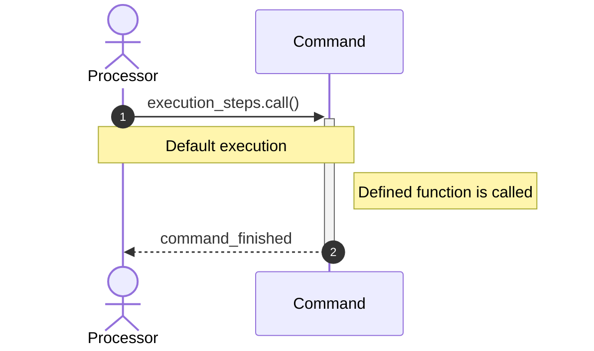
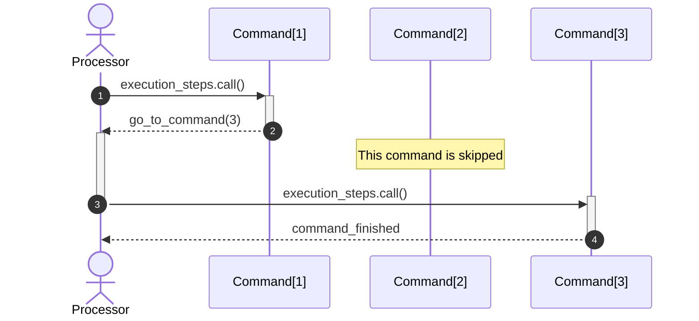

# Command
Command is a Collection derivation, containing information about what the processor should do when it reach that command.

Each command defines its own behavior and should notify the processor when it ends or what should be the next step that it should take.

We define a `Command` as a single object that contains information about:
- Its task.
- Its block visual information.

 
---

## Command flow

The command execution is usually a single, synchronous, function call:

Command itself can tell which path should processor take:


## Creating commands through code.

You can create _any_ command through code, but they do nothing by themselves without a `CommandProcessor` that can handles them and without a `CommandCollection` that defines their relation with other commands:
```gdscript
extends Node

func _ready() -> void:
  var fake_command := Command.new()
  
  # We can create other commands too
  var PrintCommandTemplate = load("res://addons/blockflow/command_print.gd")
  var fake_print_command = PrintCommandTemplate.new()

  # Or use our custom templates
  var CustomTemplate = load("res://custom_command_template.tres")
  var fake_command_from_template = CustomTemplate.get_duplicated()
```

# Command Template

A command template is any command that lives in a file form, either being a file representing a resource or a script that extends `Command`. Commands in editor are created using command templates that you found in `commands/` folder.
## Creating custom commands

To create a custom command, just extend from `Command`, define a name, its behavior and finally register it to `CommandRecord`.

### Define command template script

```gdscript
@tool # <- It MUST be tool or editor will not be able to use it.
extends Command

func _execution_steps() -> void:
	## Always notify that your command started. You have total control on
	## where to emit this signal, but be sure to emit it once.
	command_started.emit() # Notify that your command started
	
	## Implement your command behavior
	print("Hello")
	
	## Never forget to notify that you command have finished in order
	## to let the command manager know that is safe to continue to
	## the next event.
	go_to_next_command()

## Here you define your command name
func _get_name() -> StringName:
	return "CUSTOM_COMMAND"

## You can define other properties of the command,
## Editor will use those to change the command block appeareance.
func _get_icon() -> Texture:
	return load("res://icon.svg")
```

### Advanced customization
You can customize many aspects of your **command block**. The command block is the _visual representation of your command_ in the editor, its values are gathered from your command template.

> Ideally, in the future, those properties should begin with `block_` and you should be able to create your own custom command blocks, visually.

The command class usually defines a property for its block, and a "virtual" getter to define its default value:
```gdscript
var command_category:StringName # <- Block property. The Block category, in this case.

...

func _get_category() -> StringName: # <- Block default value. This command block will be grouped in "Commands" category.
	return &"Commands"
```

### Register it in `CommandRecord`

You can use your command template to create command from it. 

Even if you can simply _drag and drop_ the template into the editor to add the command, usually is easier to just register it in `CommandRecord`. This way your command will appear in the command list (left panel of the editor, where all commands are displayed).

#### With ProjectSettings
Add your template to `CommandRecord` adding its path to `blockflow/settings/commands/custom_commands`. The path should be absolute to project (it should begin with `res://`).